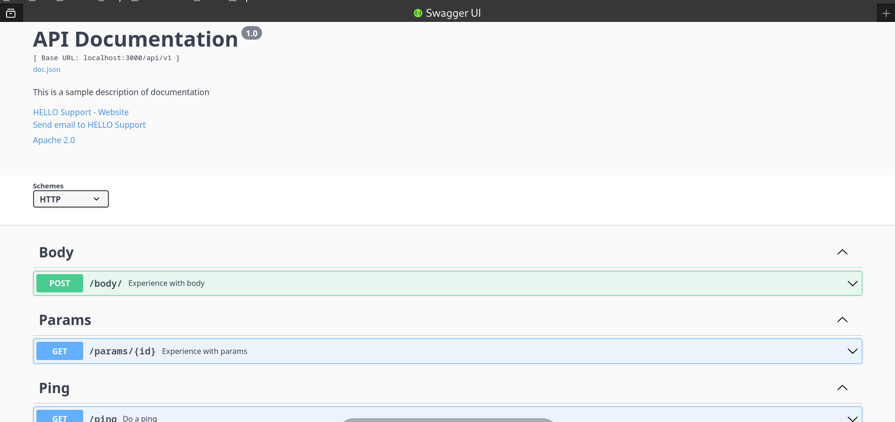
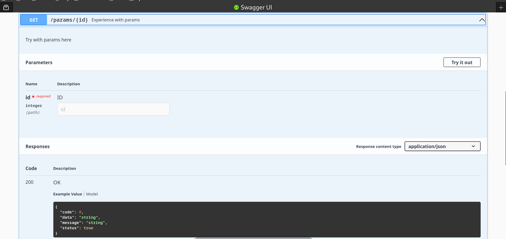
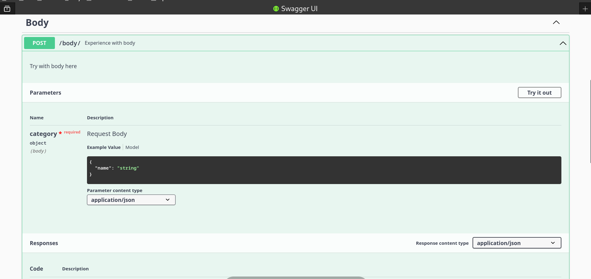

# Gin Golang + Swagger Example

This is my learning about using swagger with **Gin Framework and Go 1.19 version also my linux fedora system** for automatically render API Documentation. According to the swagger website official, It's only need use **Annotation** on directive comments and structs of golang type for live changes. I was try and learn this because one of most popular API Documentation, **POSTMAN** need to get charges for enterprise use month/person about $14-$20. For any further information, we can visit the documentation of go swagger in https://github.com/go-swagger/go-swagger

# Overview
 ## 1. First Page
 

 ## 2. With Params Example
 

 ## 3. With Request Body
 

# Pre-requisite
1. Install the swag-CLI
    ```
    go install github.com/swaggo/swag/cmd/swag@latest
    ```

2. Then, You can init the swagger docs, use it from environment variables or use alias
 - For Linux
    - Use Env
        ```
        $HOME/go/bin/swag init
        ```
    - Use Alias (After run this, you can simply call like : swag init)
        ```
        alias swag="$HOME/go/bin/swag"
        ```
 - For Windows 
    For windows you can simply add to environment variables (search on internet if you have any problem) :D

3. get all dependencies required
    ```
    go mod tidy
    ```
4. 🚀 Run the project !
    ```
    go run .
    ```
5. Go to the swagger page
    ```
    localhost:3000/swagger/index.html
    ```
6. If you have problem after running ***go run .***, Well you're not alone. Its because of the openapi library I use is compatible with go 1.19 version as well as in description. If you are higher, than u need to follow next step. (6 and 7 step is version that compatible with my go version, to search what compatible with yours, go to the github.com/go-openapi/swag and search which the tags and release date you want)

7. Go-OpenAPI/Swag install
    ```
    go get -u github.com/go-openapi/swag@v0.20.0
    ```

8. Go-OpenAPI/Spec Install
    ```
    go get github.com/go-openapi/spec@v0.20.11
    ```
9. 🚀 Try Run Again !
    ```
    go run .
    ```